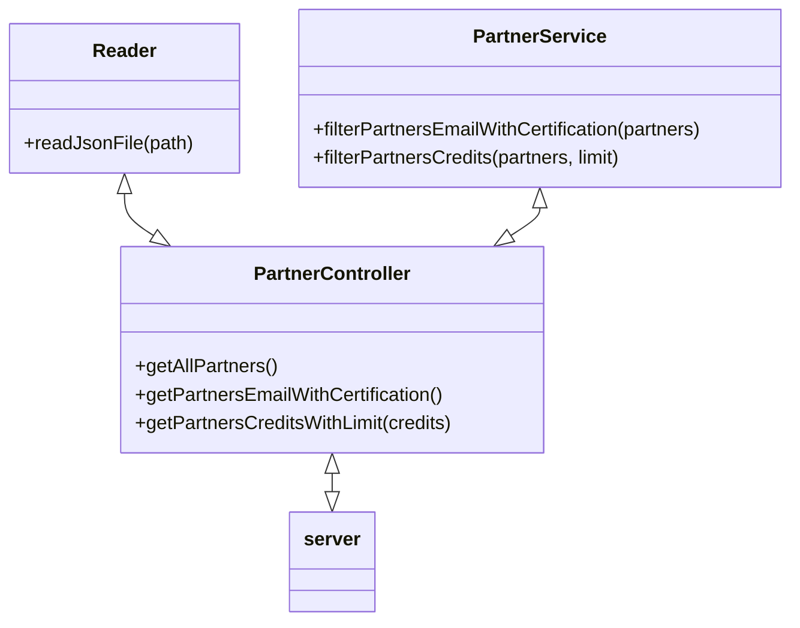

# Documentación Semana 4 MissionNodeJS - Code Challenge

## Diseño de componentes

<br>



### Server
<br>

Crea API server.

``` js
app.get("/", (request, response) => {
    response.json({message: "Code Challenge Api welcome!"});
});

app.get("/v1/partners", (request, response) => {
    const partners = PartnerController.getAllPartners();
    response.status(200).json(partners);
});

app.get("/v1/partners/withCert", (request, response) => {
    const partners = PartnerController.getPartnersEmailWithCertification();
    response.status(200).json(partners);
});

app.get("/v1/partners/credits/:credits", (request, response) => {
    const credits = request.params.credits;
    const partners = PartnerController.getPartnersCreditsWithLimit(credits);
    response.status(200).json({
        credits,
        partners
    });
});
```
<br>

### PartnerController 
<br>

Se encarga de establecer la comunicación entre el server y los servicios. Esta clase lee el archivo json con los visual partners (Reader) y realiza los filtros de información solicitados (PartnerService).

``` js
class PartnerController {

    static getAllPartners(){
        const partners = Reader.readJsonFile("visualpartners.json");
        return partners;
    }

    static getPartnersEmailWithCertification(){
        const partners = Reader.readJsonFile("visualpartners.json");
        return PartnerService.filterPartnersEmailWithCertification(partners);

    }

    static getPartnersCreditsWithLimit(credits){
        const partners = Reader.readJsonFile("visualpartners.json");
        return PartnerService.filterPartnersCredits(partners, credits);
    }
}
```
<br>

### Reader 
<br>

Clase que lee el archivo ```visualpartners.json``` que contiene todos los datos.

``` js
class Reader {
    static readJsonFile(path = ""){
        const rawdata = fs.readFileSync(path);
        return JSON.parse(rawdata);
    }
}
```
<br>

### PartnerService 
<br>

Clase que implementa los filtros ```filterPartnersEmailWithCertification``` y ```filterPartnersCredits```.

``` js
class PartnerService{

    static filterPartnersEmailWithCertification(partners){
        const filterPartners = partners.filter( partner => partner.haveCertification );

        return filterPartners.map( partner => partner.email );
    }

    static filterPartnersCredits(partners, limit){
        return partners.filter(partner => {
            if(partner.credits > limit) return partner;
        });
    }
}

```

<br>

## EndPoints

<br>

La documentación de los endpoints puede ser revisada en el siguiente link:

[Postman Documentation](https://documenter.getpostman.com/view/4966394/UyrDDvqd)

<br>

## Dependencias
<br>

- Jest: Dependencia para pruebas unitarias.
- Express: Dependencia para facilitar la creación de un API Server.